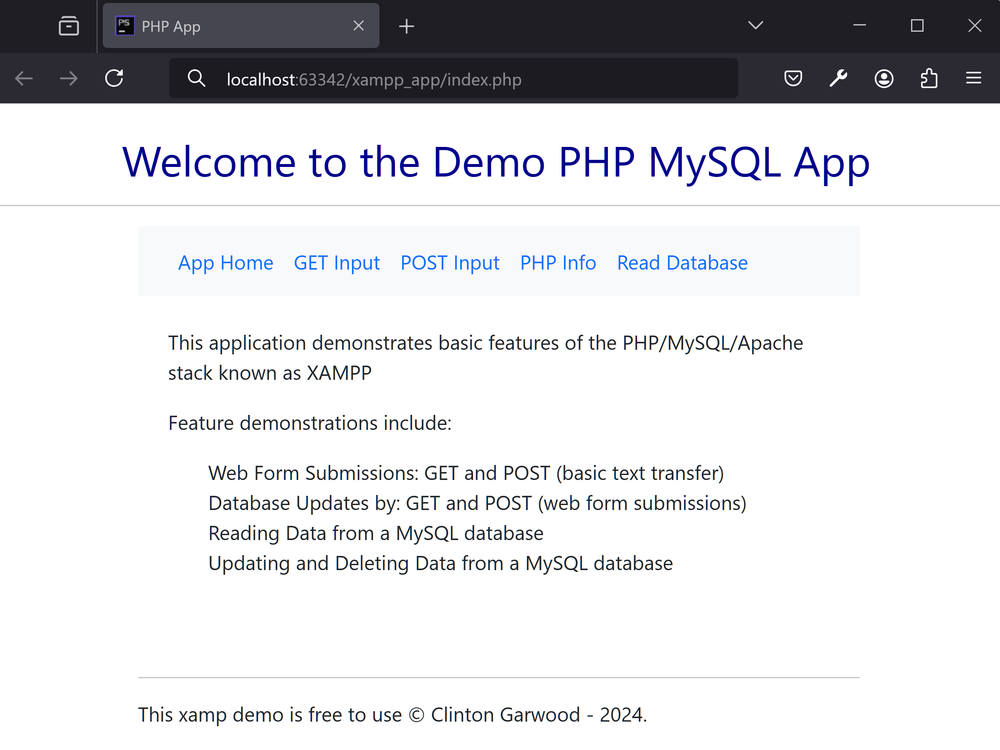
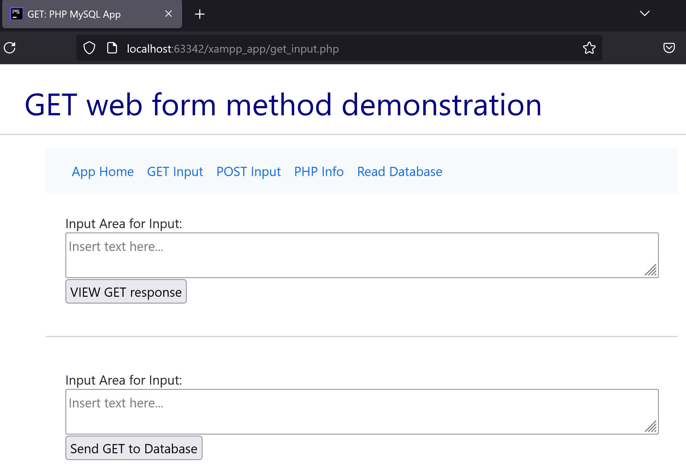
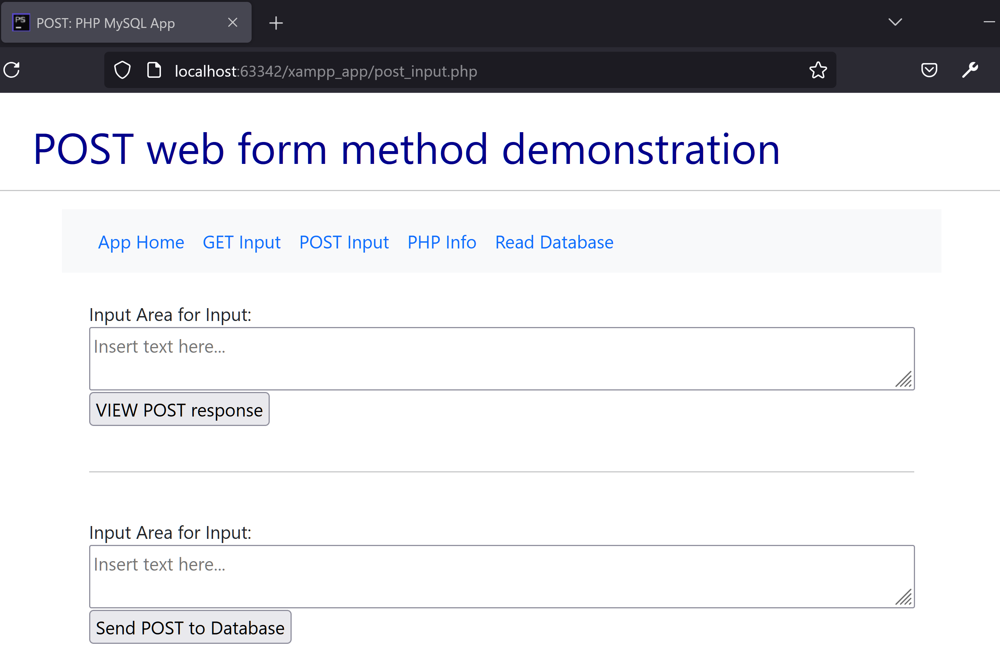
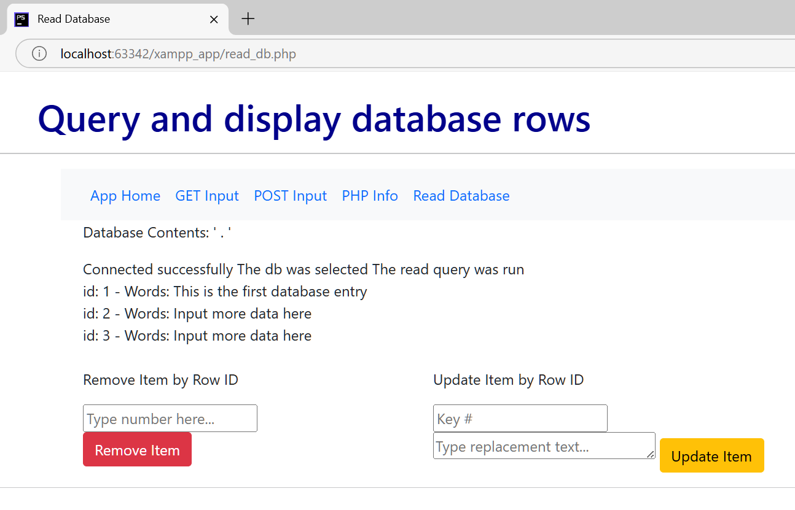

## Welcome to the Full-Stack Round Trip Data App 

---

### App Overview:
This app demonstrates the Apache, mySQL, PHP technology stack as a lightweight data-driven web application.

--- 

### Application Pages/Features 

App Home

Data Entry as GET Request

Data Entry as POST Request

View and Manage Database Entries

---

### Requirements: MySQL or MariaDB
The MySQL database is not included with this application. Please see `sql_commands.txt` for SQL statements to create the required table, database user and to populate the database with an initial record.

### Configuration:
This app relies on XAMPP (https://www.apachefriends.org/download.html), and is built using
JetBrains (https://www.jetbrains.com/) PHP Storm with an educational license. Thank you for these great tools.

### Limitations: 
There are no initial guarantees, warranties or expectations for updates to be provided to this code base.

### License:
MIT 2022 - 2025

### GitHub Repository: 
Online Version: https://github.com/theCodingProfessor/xamp_php_mysql_app/ 

### Categories: 
`Website Database`, `Website Comment`, `Productivity`, `Application Design`, `tutorial app`

### Tags: 
`data driven app`, `sql app`, `xampp app`, `mysql data app`, `user data web app`

CC by Clinton Garwood, MIT License, all others &copy; 2022 - 2025